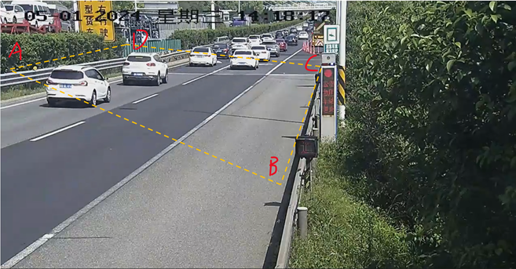
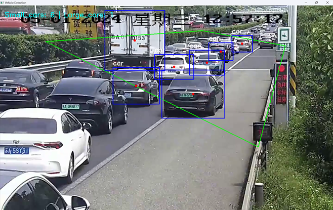
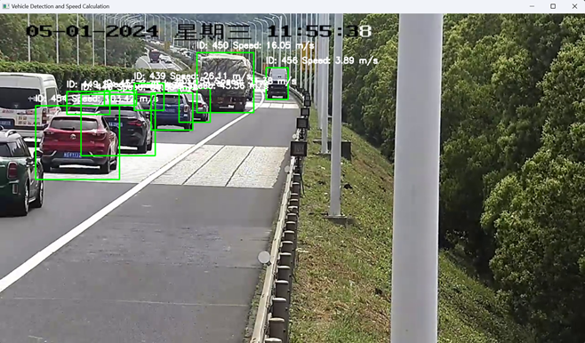
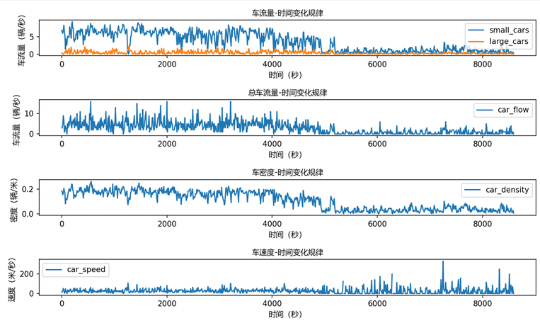
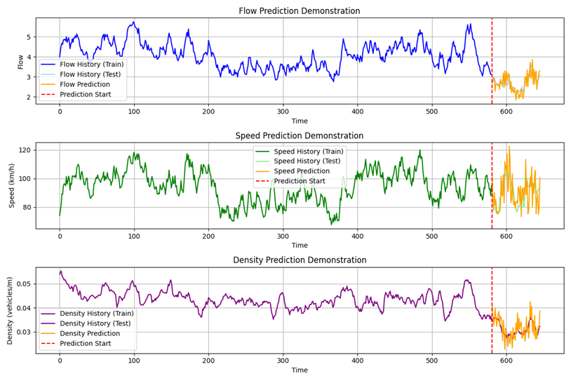
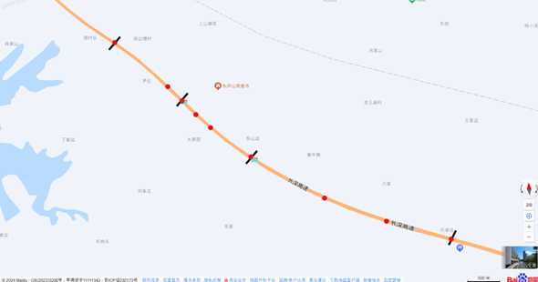

# Traffic-flow-data-extraction-and-prediction-based-on-YOLOv5-and-Sort-algorithm

使用YOLOv5与Sort算法对道路监控视频中的车流量、速度与密度参数进行提取，使用transformer对未来的交通流参数进行预测

## 环境配置

1、 安装python3.12

2、 更新pip：python -m pip install --upgrade pip

3、 创建虚拟环境：python -m venv new_venv；并激活：new_venv\Scripts\activate

4、 激活后，安装依赖包：pip install -r requirements.txt

## 划分监测区域，根据道路标志确定实际距离

根据《中华人民共和国国家标准 GB 5768.3—2009 道路交通标志和标线 第3部分：道路交通标线》：设计速度不小于60km/h的道路，可跨越同向车行道分界线的线段及间隔长度分别为600cm和900cm。

103_20s.mp4监控视频路面，AB到CD之间的估测实际距离40米。

运行selectDetectArea_photo.py对图片或者selectDetectArea_video.py对视频标定监控区域，得到ABCD四点的坐标points= [(39, 234), (957, 626), (1104, 230), (438, 151)]。

##  交通流参数的提取

步骤：

①  设置检测区域四个顶点ABCD ，这由points定义。运行carDetect_YOLOv5.py进行目标检测，得到每帧的数据；carDetect_YOLOv5_Sort.py识别车速度

②  运行car_flow_line.py生成车流量（辆/秒）

③  设置AB到CD的实际距离abTocd_len，运行car_flow_rect.py生成密度（辆/米）

④  运行generateSpeedDensity.py,运用公式计算速度=流量/密度，同时包含每秒小型车和大型车流量情况

 

使用YOLOv5目标检测算法，对每一帧中出现的车辆进行统计，为避免同一车辆在检测区域中被统计多次，需要使用追踪算法，例如 Kalman Filter、SORT 或 Deep SORT。

 

- 区域车流量的计算：计算每一帧中，出现在检测区域内car、truck、bus的数量，得到每一帧中检测到的车辆数car_flow_per_frame_rect。25帧为1秒，求连续相邻25帧的car_flow_per_frame_rect的平均值可得这一秒之内检测区域中出现的平均车辆数，作为该路段这一秒的车流量car_flow。绘制car_flow与时间的关系曲线，观察车流量的变化规律。

 

- 某时刻界线车流量的计算：计算每一帧中通过界线L的车辆数量，每25帧为1秒，连续相邻25帧中车辆数量之和即为这1秒内通过的车辆数量。

 

carDetect_YOLOv5.py：使用YOLOv5算法对车辆进行识别，输出为该文件包含了每一帧经过界线AB的车辆情况car_flow_per_frame_line.csv，以及包含了每一帧中在监测矩形方框范围内的车辆情况car_flow_per_frame_rect.csv。

carDetect_YOLOv5_Sort.py运用Sort追踪算法实现对车辆的实时跟踪、速度计算

绘制交通流参数随时间变化规律：

 

## 使用神经网络对未来交通流参数进行预测

## 监控点位布设方案优化

使用模拟退火算法simulated_annealing.py得到监控点位优化方案

初始化参数如下表：

| 参数           | 初始值           | 说明                      |
| -------------- | ---------------- | ------------------------- |
| L              | [1,2,3]          | 将道路划分为3段子区间     |
| d              | [1000,1000,3000] | d[i]代表第i个子区间的长度 |
| T0             | 1000             | 初始温度                  |
| t_min          | 1e-12            | 温度下限                  |
| a              | 0.95             | 温度下降速率              |
| max_iterations | 1800             | 迭代次数                  |
| D              | 200              | 两点间最小距离            |
| Cf             | 3                | 固定建设成本              |
| cs             | 0.5              | 维修成本                  |
| ck             | 1.5              | 摄像机成本                |
| r              | 150              | 监控范围                  |
| K              | 1                | 初始温度迭代次数          |
| W1             | 0.2338           | 经济成本权重              |
| W2             | 0.6289           | 重要性权重                |
| W3             | 0.13372          | 交通量权重                |
| xi             | 0                | 决策变量                  |

监控点布设优化方案：

